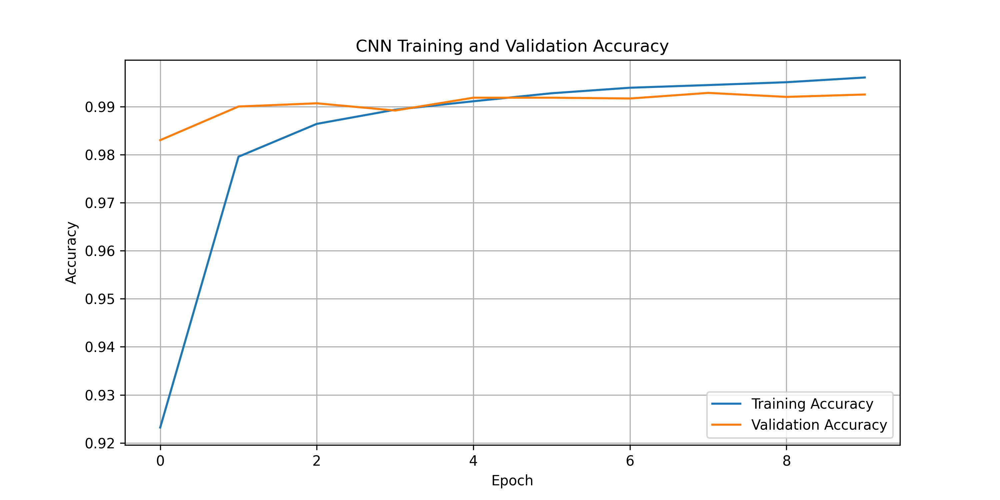
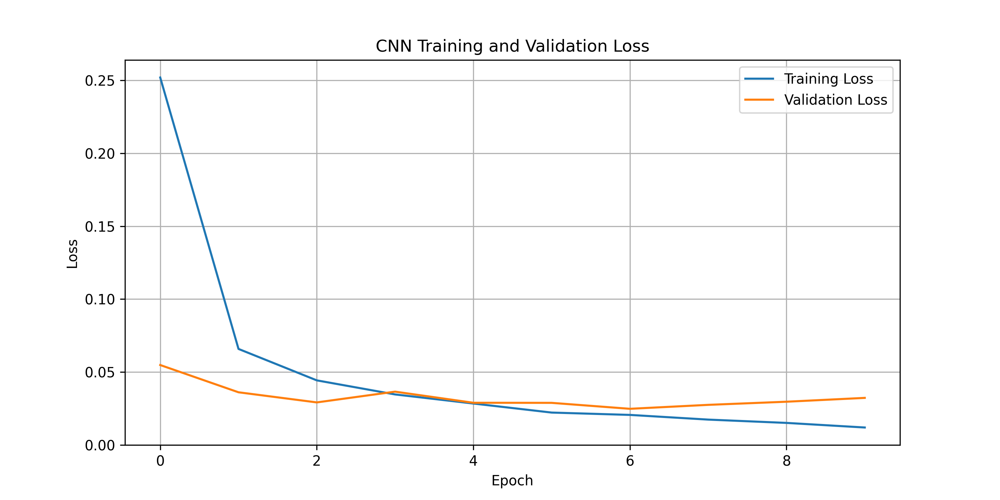
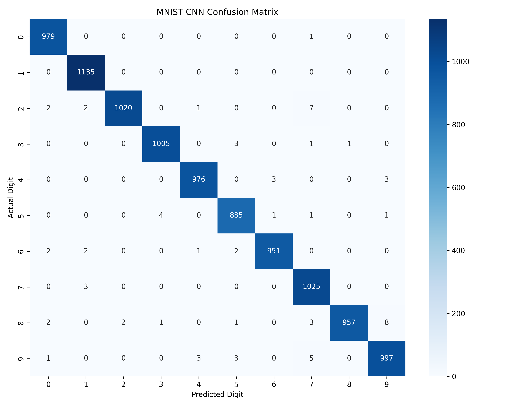

<p align="center">
  
</p>

<p align="center">
  <b>🔢 AI-Based Handwritten Digit Recognition System</b><br>
  <sub>Deep Learning • Computer Vision • CNN • Flask Web Application</sub>
</p>

---

# 🔢 AI-Based Handwritten Digit Recognition System

An end-to-end **Deep Learning and Flask-based web application** that recognizes handwritten digits from **0 to 9** using a Convolutional Neural Network (CNN).

The project uses the **MNIST dataset** and includes image preprocessing, CNN model training, evaluation, confusion-matrix analysis, classification metrics, custom image prediction, confidence-score prediction, and an interactive web interface.

---

# 📌 Project Overview

The system applies a Convolutional Neural Network to handwritten digit images and predicts which digit class, from **0 to 9**, the input belongs to.

The complete workflow is:

```text
MNIST Dataset
     ↓
Data Preprocessing
     ↓
Pixel Normalization
     ↓
CNN Training
     ↓
Model Evaluation
     ↓
Confusion Matrix
     ↓
Classification Metrics
     ↓
Saved CNN Model
     ↓
Custom Image Prediction
     ↓
Flask Web Application
     ↓
Digit + Confidence Score
```

---

# 🎯 Objectives

- Build a CNN model for handwritten digit recognition.
- Train and evaluate the model using the MNIST dataset.
- Normalize image pixel values from 0–255 to 0–1.
- Reshape images for CNN input.
- Evaluate the trained model using accuracy and loss.
- Generate a confusion matrix and classification report.
- Analyze correct and incorrect predictions.
- Support custom handwritten digit image prediction.
- Provide a confidence score for predictions.
- Allow users to draw digits directly in a web browser.
- Build a clean, GitHub-ready AI/ML project.

---

# ✨ Key Features

### 🧹 Image Preprocessing
- MNIST image loading
- Grayscale image processing
- Pixel normalization
- 28 × 28 CNN input format
- Custom-image preprocessing
- Digit detection and cropping
- Centering and padding for drawn digits

### 📊 Model Evaluation
- Test accuracy
- Test loss
- Precision
- Recall
- F1-score
- Classification report
- Confusion matrix
- Accuracy curve
- Loss curve
- Correct prediction visualization
- Incorrect prediction visualization

### 🧠 Deep Learning
- Convolutional Neural Network
- Adam optimizer
- Sparse categorical crossentropy
- ReLU activation
- Softmax output layer
- Dropout regularization
- Early stopping
- Model checkpointing

### 🌐 Web Application
- Flask backend
- Image upload
- Drawing canvas
- Real-time prediction request
- Predicted digit display
- Confidence-score display
- Clear canvas functionality
- Responsive interface

---

# 📊 Dataset

The project uses the:

```text
MNIST Handwritten Digit Dataset
```

Dataset summary:

| Property | Value |
|---|---:|
| Training images | 60,000 |
| Testing images | 10,000 |
| Image size | 28 × 28 pixels |
| Number of classes | 10 |
| Classes | 0–9 |
| Image type | Grayscale |

## Target Classes

```text
0  1  2  3  4  5  6  7  8  9
```

---

# 🧹 Data Preprocessing

The MNIST images contain grayscale pixel values between:

```text
0–255
```

The project normalizes these values to:

```text
0–1
```

The images are then represented for CNN processing as:

```text
28 × 28 × 1
```

For custom images, the application additionally performs:

```text
Input Image
     ↓
Grayscale Conversion
     ↓
Digit Detection
     ↓
Bounding Box Cropping
     ↓
Centering + Padding
     ↓
Resize
     ↓
28 × 28 Format
     ↓
Pixel Normalization
```

---

# 🏗️ System Architecture

```text
                    ┌──────────────────────┐
                    │        User          │
                    └──────────┬───────────┘
                               │
                               ▼
                    ┌──────────────────────┐
                    │    Flask Web App     │
                    └──────────┬───────────┘
                               │
                               ▼
                    ┌──────────────────────┐
                    │   Image / Drawing    │
                    └──────────┬───────────┘
                               │
                               ▼
                    ┌──────────────────────┐
                    │ Image Preprocessing  │
                    └──────────┬───────────┘
                               │
                               ▼
                    ┌──────────────────────┐
                    │    CNN Model         │
                    └──────────┬───────────┘
                               │
                               ▼
                    ┌──────────────────────┐
                    │ Probability Output   │
                    └──────────┬───────────┘
                               │
                               ▼
                    ┌──────────────────────┐
                    │ Digit + Confidence   │
                    └──────────────────────┘
```

---

# 🧠 Deep Learning Model

## Convolutional Neural Network

The project uses a CNN designed for 28 × 28 grayscale MNIST images.

### Architecture

```text
Input
28 × 28 × 1
    ↓
Conv2D
32 filters, 3 × 3
    ↓
MaxPooling2D
    ↓
Conv2D
64 filters, 3 × 3
    ↓
MaxPooling2D
    ↓
Conv2D
128 filters, 3 × 3
    ↓
Flatten
    ↓
Dense
128 neurons
    ↓
Dropout
0.3
    ↓
Dense
10 neurons
    ↓
Softmax
    ↓
Digit Prediction
```

### Training Configuration

| Parameter | Value |
|---|---:|
| Algorithm | Convolutional Neural Network |
| Optimizer | Adam |
| Loss function | Sparse Categorical Crossentropy |
| Batch size | 128 |
| Maximum epochs | 15 |
| Validation split | 10% |
| Dropout | 0.30 |
| Output classes | 10 |
| Input size | 28 × 28 × 1 |

---

# 📈 Model Performance

The trained CNN was evaluated on the complete **10,000-image MNIST test set**.

## Final Test Results

| Metric | Result |
|---|---:|
| Test Loss | 0.0243 |
| Test Accuracy | **99.30%** |
| Weighted Precision | **99.30%** |
| Weighted Recall | **99.30%** |
| Weighted F1-Score | **99.30%** |

## Class-wise F1-Score

| Digit | F1-Score |
|---:|---:|
| 0 | 0.9959 |
| 1 | 0.9969 |
| 2 | 0.9932 |
| 3 | 0.9950 |
| 4 | 0.9944 |
| 5 | 0.9910 |
| 6 | 0.9942 |
| 7 | 0.9899 |
| 8 | 0.9907 |
| 9 | 0.9881 |

---

# 📊 Evaluation Outputs

The project generates:

```text
outputs/
├── accuracy_curve.png
├── loss_curve.png
├── training_history.txt
├── classification_report.txt
├── confusion_matrix.png
├── correct_predictions.png
├── incorrect_predictions.png
└── evaluation_summary.txt
```

### Accuracy Curve



### Loss Curve



### Confusion Matrix



---

# 🔎 Custom Image Prediction

The project supports prediction on custom handwritten digit images.

Run:

```bash
python predict.py
```

The system asks for an image path:

```text
Enter the path of the digit image:
```

Example:

```text
dataset/test_digit_7.png
```

Example output:

```text
===================================
       DIGIT PREDICTION
===================================
Predicted Digit: 7
Confidence:      100.00%
===================================
```

---

# ✏️ Drawing-Based Prediction

The Flask application includes a drawing canvas.

The prediction pipeline is:

```text
User Draws Digit
      ↓
Canvas Image
      ↓
Digit Detection
      ↓
Crop Digit
      ↓
Center + Pad
      ↓
Resize
      ↓
Normalize
      ↓
CNN
      ↓
Predicted Digit
      ↓
Confidence Score
```

Example web prediction:

```text
Predicted Digit: 8
Confidence: 99.03%
```

---

# 🌐 Web Application

The Flask application provides:

- Upload handwritten digit images.
- Draw digits using the browser canvas.
- Send the image to the CNN model.
- Display the predicted digit.
- Display the prediction confidence.
- Clear and redraw the canvas.

Start the application:

```bash
python app.py
```

The application normally runs at:

```text
http://127.0.0.1:5000
```

Open that address in a browser.

Stop the server with:

```text
Ctrl + C
```

---

# 📁 Generated Outputs

```text
outputs/
├── accuracy_curve.png
├── loss_curve.png
├── training_history.txt
├── classification_report.txt
├── confusion_matrix.png
├── correct_predictions.png
├── incorrect_predictions.png
└── evaluation_summary.txt
```

---

# 📁 Project Structure

```text
AI_Handwritten_Digit_Recognition/
│
├── dataset/
│   └── test_digit_7.png
│
├── models/
│   ├── mnist_cnn_best.keras
│   └── mnist_cnn_final.keras
│
├── outputs/
│   ├── accuracy_curve.png
│   ├── loss_curve.png
│   ├── training_history.txt
│   ├── classification_report.txt
│   ├── confusion_matrix.png
│   ├── correct_predictions.png
│   ├── incorrect_predictions.png
│   └── evaluation_summary.txt
│
├── notebooks/
│
├── static/
│   ├── style.css
│   └── script.js
│
├── templates/
│   └── index.html
│
├── utils/
│
├── .vscode/
│   └── settings.json
│
├── app.py
├── train.py
├── evaluate.py
├── predict.py
├── requirements.txt
├── README.md
└── .gitignore
```

---

# ⚙️ Installation

## 1. Open the Project

Open the project directory in Visual Studio Code.

## 2. Create a Virtual Environment

```bash
python -m venv venv
```

## 3. Activate the Environment

### Git Bash

```bash
source venv/Scripts/activate
```

### Command Prompt

```cmd
venv\Scripts\activate
```

### PowerShell

```powershell
venv\Scripts\Activate.ps1
```

## 4. Install Dependencies

```bash
python -m pip install -r requirements.txt
```

---

# 🧪 Train the CNN

Run:

```bash
python train.py
```

The training pipeline performs:

```text
Load MNIST
     ↓
Normalize Images
     ↓
Reshape Images
     ↓
Build CNN
     ↓
Train CNN
     ↓
Validate Model
     ↓
Evaluate Test Set
     ↓
Save Model
     ↓
Generate Training Curves
```

The trained models are saved in:

```text
models/
```

---

# 📊 Evaluate the Model

Run:

```bash
python evaluate.py
```

The evaluation pipeline generates:

- Classification report
- Confusion matrix
- Precision
- Recall
- F1-score
- Correct prediction visualization
- Incorrect prediction visualization
- Evaluation summary

---

# 🧪 Test Custom Prediction

Run:

```bash
python predict.py
```

Enter a handwritten digit image path when prompted.

Example:

```text
dataset/test_digit_7.png
```

---

# ▶️ Run the Web Application

Start Flask:

```bash
python app.py
```

Open:

```text
http://127.0.0.1:5000
```

You can then:

1. Upload a digit image.
2. Draw a digit.
3. Click Predict.
4. View the predicted digit.
5. View the confidence score.

---

# 🛠️ Technologies Used

| Technology | Purpose |
|---|---|
| Python 3.10 | Core development |
| TensorFlow | Deep Learning |
| Keras | CNN model development |
| NumPy | Numerical operations |
| Pandas | Data handling |
| Scikit-learn | Evaluation metrics |
| Matplotlib | Visualization |
| Seaborn | Confusion matrix visualization |
| Pillow | Image processing |
| Flask | Web application |
| HTML5 | User interface |
| CSS3 | Styling |
| JavaScript | Drawing and prediction requests |
| Git | Version control |
| GitHub | Repository hosting |

---

# 🧩 Main Files

### `train.py`

Loads MNIST, preprocesses the images, builds the CNN, trains the model, evaluates test performance, saves the model, and generates training curves.

### `evaluate.py`

Loads the trained CNN and evaluates all 10,000 MNIST test images. It generates classification metrics, a confusion matrix, and prediction visualizations.

### `predict.py`

Performs prediction on custom handwritten digit images and returns the predicted digit with a confidence score.

### `app.py`

Runs the Flask application and handles uploaded/drawn image prediction requests.

### `index.html`

Provides the main browser interface.

### `style.css`

Controls the appearance and responsive design of the web application.

### `script.js`

Handles drawing, image upload, and communication with the Flask prediction endpoint.

---

# 🎓 Skills Demonstrated

This project demonstrates practical knowledge of:

- Artificial Intelligence
- Deep Learning
- Convolutional Neural Networks
- Computer Vision
- Image Preprocessing
- MNIST Dataset
- TensorFlow/Keras
- Model Training
- Model Evaluation
- Classification Metrics
- Confusion Matrix
- Data Visualization
- Custom Image Prediction
- Flask Web Development
- HTML, CSS and JavaScript
- Git and GitHub
- AI Application Development

---

# ⚠️ Limitations

- The model is trained specifically on the MNIST handwritten digit dataset.
- Custom images can differ from MNIST in handwriting style, stroke width, positioning, and background.
- Prediction confidence is the CNN softmax probability and should not be interpreted as a guaranteed measure of correctness.
- The web application is intended as an academic/development demonstration.
- The current application runs locally unless separately deployed.

---

# 🚀 Future Enhancements

Possible future improvements include:

- Mobile-friendly drawing controls
- Better digit segmentation
- Data augmentation
- Hyperparameter tuning
- CNN architecture comparison
- MLP vs CNN comparison
- Model conversion for mobile deployment
- REST API deployment
- Docker support
- Cloud deployment
- Prediction history
- More advanced computer-vision preprocessing
- Model monitoring and retraining

---

# 📸 Screenshots

## 📝 Web Application

Add the project screenshot here:

```text
screenshots/web-interface.png
```

Example Markdown:

```markdown

```

## 🔢 Drawing Prediction

Add a screenshot of a successful browser prediction:

```text
screenshots/drawing-prediction.png
```

Example:

```markdown

```

---

# 🔬 Reproducibility

To reproduce the project:

```text
1. Open the project
2. Create the Python 3.10 virtual environment
3. Activate the virtual environment
4. Install requirements.txt
5. Run train.py
6. Run evaluate.py
7. Test predict.py
8. Run app.py
9. Open http://127.0.0.1:5000
```

The project uses a fixed random seed in the training configuration where applicable.

---

# 👨‍💻 Author

## Sovit Srujan Behera

**Computer Science & Engineering**

**C V Raman Global University, Odisha**

GitHub:

```text
https://github.com/SOVIT-07
```

---

# 📜 License

This project is intended for **educational, academic, and research purposes**.

It demonstrates Deep Learning, computer vision, image classification, Python development, and Flask web application development.

---

<p align="center">
  <b>AI-Based Handwritten Digit Recognition System</b><br>
  Deep Learning • CNN • MNIST • TensorFlow • Flask
</p>
